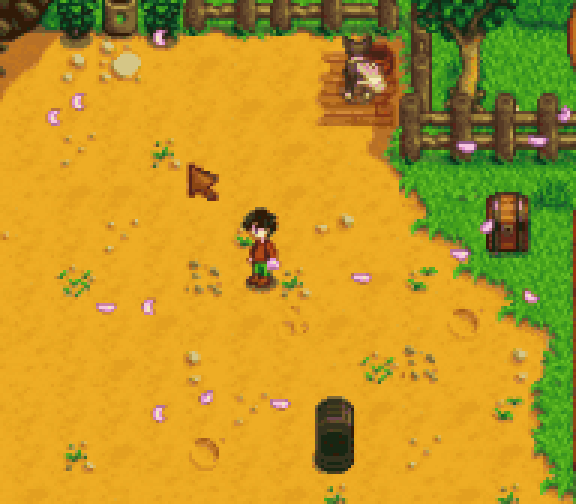
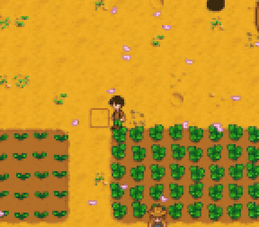
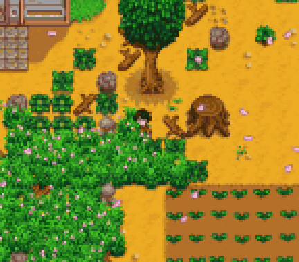

# 行为学 · Behavior Automation

框选一片区域，让角色自动寻路，完成农活、采集、动物照料和农场改建。作业使用实际工具和材料，保留体力消耗与工具等级限制。

## 使用

| 默认操作 | 功能 |
| --- | --- |
| Shift + 左键拖动 | 执行手持道具对应的行为，并加入左键全局行为 |
| Shift + 右键拖动 | 根据目标智能选择可用工具 |
| F8 | 打开图标行为面板 |
| 再次按 Shift / 打开背包 / 持续移动两秒 | 取消当前任务 |

新选区替换旧任务。短暂手动移动时优先响应玩家，松开后继续作业。

## 功能

- 开垦、播种、种树、浇水、收获成熟作物；种树预留间距。
- 根据水壶等级与延伸附魔蓄力浇水，缺水时寻找当前地图内可达水源。
- 采集物、果实、机器成品，以及杂草、牧草、石矿、树枝、树木与树桩处理。
- 抚摸动物与宠物、挤奶、剪毛、添干草和给宠物水碗加水。
- 铺设、拆除地板和路径，以及放置围栏、火把、洒水器、箱子和机器。

开垦、挖掘点、种植、放置和拆地板需要手持对应道具，通过左键框选执行。动物管理和贵重物品使用保留手动操作。单人游戏可借用仓库工具，用后归还；联机仅使用背包工具。

## 实机演示

**日常照料**



<details>
<summary>农田作业</summary>



</details>

<details>
<summary>区域清理</summary>



</details>

## 配置

F8 面板包含三个独立页面：

- **左键基础**：手持相应道具时允许执行的行为。
- **左键全局**：不限制手持物，额外加入左键选区的行为。
- **右键工具池**：右键框选时允许智能选择的行为。

高亮表示启用，支持全选与清空，点击即保存。


安装 [Generic Mod Config Menu](https://www.nexusmods.com/stardewvalley/mods/5098) 后，可以在游戏内修改快捷键、体力下限和仓库工具设置。

## 安装与要求

需要 **Stardew Valley 1.6.15+**、[SMAPI 4.5.2+](https://smapi.io/)。Generic Mod Config Menu 可选。

解压成品包，将其中的 `BehaviorAutomation` 文件夹放入游戏 `Mods`，通过 SMAPI 启动。升级时退出游戏，保留 `config.json` 并覆盖旧版文件。

当前验证环境为 Windows、Stardew Valley 1.6.15、SMAPI 4.5.2。

## 从源码构建

在仓库根目录运行：

```powershell
./mods/BehaviorAutomation/build.ps1 -GamePath '你的 Stardew Valley 安装目录'
```

输出位于 `.artifacts/BehaviorAutomation/package/`。构建不会安装或启动游戏。

[完整使用说明](docs/USER-GUIDE.md) · [更新记录](docs/CHANGELOG.md) · [开发与测试](docs/DEVELOPMENT.md) · [MIT 许可](LICENSE)

感谢 ConcernedApe、SMAPI 与 Generic Mod Config Menu 的作者和维护者，以及提供测试与反馈的玩家。
