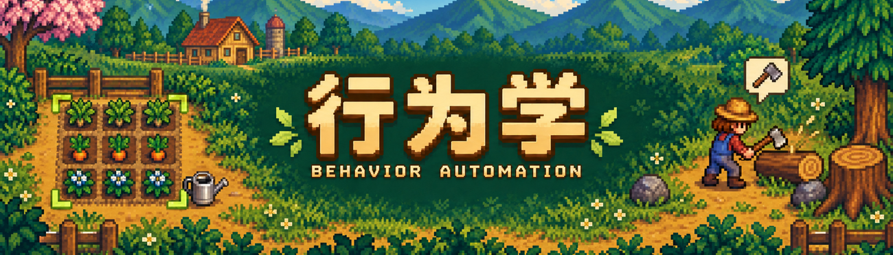
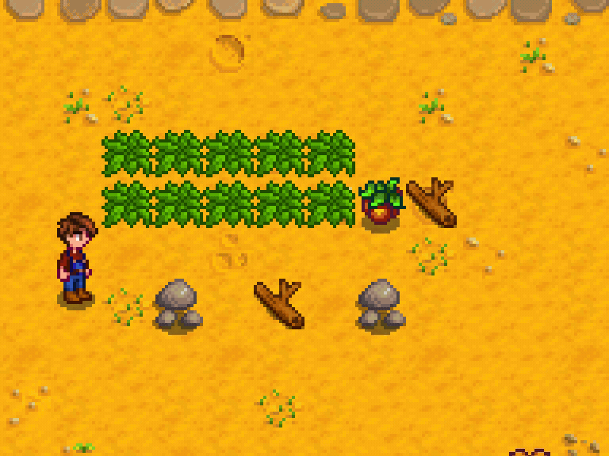
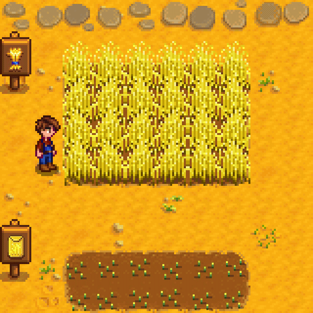
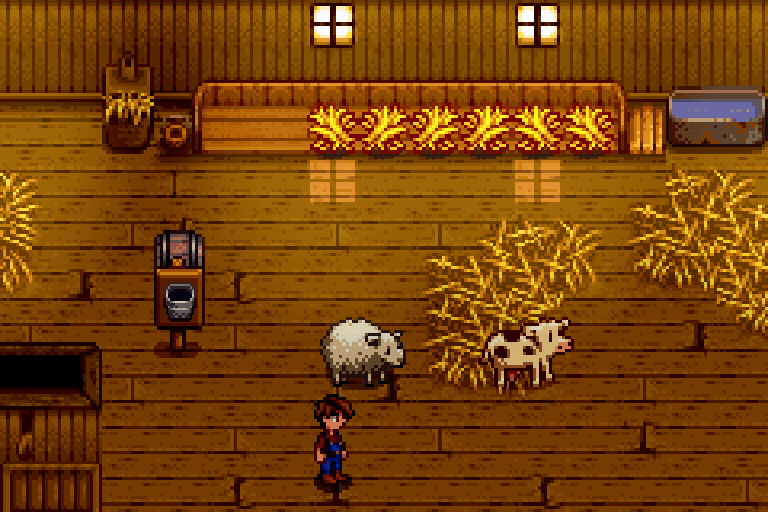
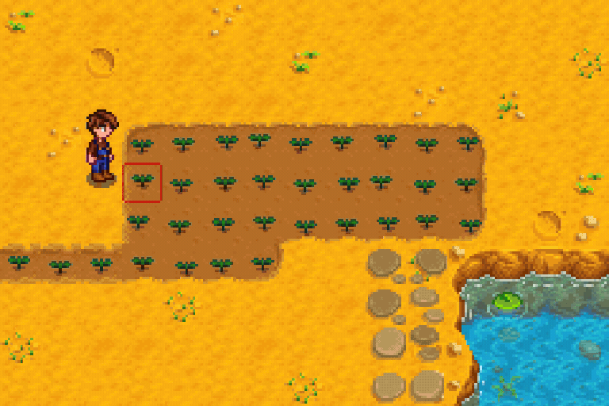

<p align="center"><a href="README.md"><strong>English</strong></a> · <a href="README.zh-CN.md">简体中文</a></p>



<h1 align="center">Behavior Automation</h1>
<p align="center">Select an area. Let your farmer take care of the routine.</p>
<p align="center"><a href="https://github.com/SZnine/stardew-valley-mod/releases/tag/behavior-automation-v2.2.1">Download 2.2.1</a> · <a href="https://www.nexusmods.com/stardewvalley/mods/52289">Nexus Mods</a> · <a href="#controls">Controls</a> · <a href="docs/CHANGELOG.md">Changelog</a></p>

Automate everyday farm work, animal care, and farm renovation by selecting an area. Your farmer walks to each task using your tools and materials, with normal energy costs and tool requirements.

## See it in action

<table>
<tr><th>Smart tool selection</th><th>Harvesting</th></tr>
<tr>
<td align="center" valign="top" width="50%"><br>Clear mixed debris with the tools you own.</td>
<td align="center" valign="top" width="50%"><br>Harvest ripe crops in groups; leave young crops intact.</td>
</tr>
<tr><th>Animal care</th><th>Watering &amp; refilling</th></tr>
<tr>
<td align="center" valign="top" width="50%"><br>Pet, milk, shear, and fill hay troughs.</td>
<td align="center" valign="top" width="50%"><br>Use charged watering and refill at reachable water sources.</td>
</tr>
</table>

## Controls

| Default input | Action |
| :--- | :--- |
| **Shift + left-drag** | Use the selected tool or material, plus enabled left-click extra actions. |
| **Shift + right-drag** | Choose suitable available tools from the smart action pool. |
| **F8** | Open the action panel. |
| **Press Shift again**, open inventory, or **move for 0.5 seconds** | Cancel the current work. |

Release the mouse button to start. A new selection replaces the previous one. Brief manual movement takes priority; work resumes when you stop moving.

## What you can automate

| Work | Included actions |
| :--- | :--- |
| **Crops & gathering** | Till soil, dig artifact spots, plant seeds and spaced trees, water, harvest mature crops, collect forage, fruit, moss, and machine output. |
| **Clearing & mining** | Weeds, grass, dead crops, twigs, trees, stumps, stones, and large debris your tools can break. |
| **Daily animal care** | Pet farm animals and pets, milk, shear, add hay, fill pet bowls, and collect produce. |
| **Farm renovation** | Lay and remove floors or paths; place fences, torches, sprinklers, chests, and machines. |

Tilling, digging spots, planting, placement, and floor removal require the corresponding held item and a left-click selection. Animal sales, relocation, renaming, and valuable treats remain manual.

## Choose your actions

The **F8** panel has three independent pages. Click an icon to toggle it; highlighted icons are enabled. Each page has **Select all** and **Clear**.

| Page | Applies to |
| :--- | :--- |
| **Left held item** | Work performed with the selected tool, seed, or material. |
| **Left extras** | Additional actions regardless of the held item; gathering and daily animal care are enabled by default. |
| **Right tool pool** | Actions allowed to choose their tools automatically. |

With [Generic Mod Config Menu](https://www.nexusmods.com/stardewvalley/mods/5098), configure hotkeys, movement cancellation, diagonal paths, scythe planning, refilling, obstacle clearing, stored tools, and energy reserve. The F8 panel works without it.

## Install & update

1. Install [SMAPI 4.5.2+](https://smapi.io/) for **Stardew Valley 1.6.15+**.
2. Download the mod package and extract its **BehaviorAutomation** folder into the game's **Mods** folder.
3. Launch through SMAPI. Generic Mod Config Menu is optional.

To update, exit the game, keep `config.json`, and replace the old mod files.

<details>
<summary><strong>Tools, storage, and multiplayer</strong></summary>

Left-click base work keeps the selected tool, including when clearing a blocked route. Smart and extra actions can choose from your available tools. In single-player, tools can be borrowed from storage and returned after use; multiplayer uses backpack tools only.

</details>

<details>
<summary><strong>Build from source</strong></summary>

From the repository root, with a .NET SDK that supports `net6.0`:

```powershell
./mods/BehaviorAutomation/build.ps1 -GamePath 'C:\Games\Stardew Valley'
```

Packages are written to `.artifacts/BehaviorAutomation/package/`.

</details>

[User guide](docs/USER-GUIDE.md) · [Development & tests](docs/DEVELOPMENT.md) · [Report an issue](https://github.com/SZnine/stardew-valley-mod/issues) · [MIT license](LICENSE)

Thanks to ConcernedApe, the SMAPI and Generic Mod Config Menu maintainers, and everyone who tests the mod and reports issues.
