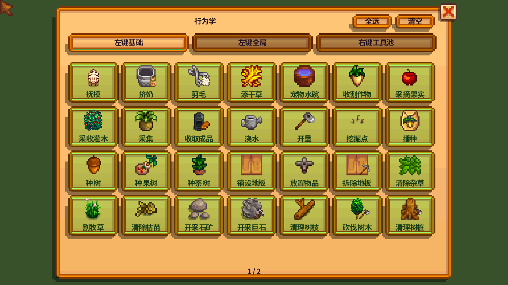
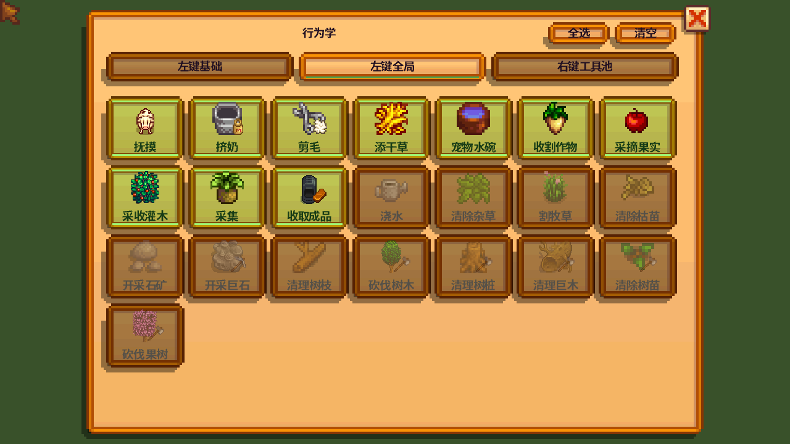
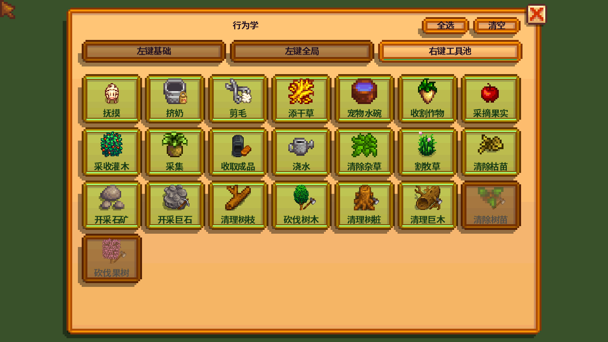

# 行为学

| 操作 | 功能 |
| --- | --- |
| 按住 Shift + 左键拖动 | 按左键基础处理手持道具，并加入左键全局行为 |
| 按住 Shift + 右键拖动 | 从允许的行为中自动选择工具并处理选区 |
| F8 | 打开 / 关闭图标行为面板 |
| 再次按 Shift | 取消任务 |
| 连续移动两秒 / 打开背包 | 取消任务 |

新框选总是替换旧选区。空选区立即结束。短暂移动时让玩家先走，松开后继续工作。头顶动态图标表示当前任务，工作区域不留常驻标记。

## 行为面板

| 页面 | 作用 |
| --- | --- |
| 左键基础（第一项） | 手持相应工具、种子或材料时，左键框选允许执行的行为 |
| 左键全局 | 不限手持道具，左键框选额外加入的行为 |
| 右键工具池 | 右键框选允许智能选择的行为 |

三页独立，无总开关或父子关系。例如：基础允许伐木、全局关闭伐木，只有手持斧头左键框选才会砍树。全局允许挤奶时，即使手持食物，也能借用可用的挤奶桶完成挤奶。

左键全局默认包含采集与动物日常照料。锄地、种植和放置只出现在左键基础页，需要手持对应道具。

绿色高亮表示选中，暗色表示关闭。每页都有全选、清空，作用于整页。点击即保存，Tab 切页，滚轮翻动。

## 铺设与放置

拿着地板、路径、围栏、火把、洒水器、箱子或机器，按住 Shift 左键框选。

- 按行安排位置，数量不超过背包内同类材料的实际总数。
- 跳过已铺地板、已有物品、作物与不能放置的位置，不替换已有内容。
- 走到位置后调用原版放置，成功才消耗材料；取消后停止。
- 不从箱子或其他物品中推断建筑材料。炸弹、楼梯、家具和整屋壁纸不作为区域填充物品。

## 拆除地板

手持斧头或镐子，按住 Shift 左键框选地板或路径。F8 → 左键基础 → 拆除地板，可独立关闭。原版掉落材料保持不变；已有物品、家具或建筑覆盖的位置会跳过。左键全局和右键工具池不包含此项。

## 自动作业

- 按真实目标选择站位并寻路，镰刀尽量成片收获，只处理成熟作物。
- 浇水根据水壶等级和延伸附魔选择蓄力范围；缺水时在当前地图寻找可达池边、水井等位置，补满后继续。只浇选中且允许的目标。
- 空手交互包含成熟作物、采集物、机器成品等。动物照料包含抚摸、挤奶、剪毛、添干草、宠物与水碗；改名、出售、迁移和金色动物饼干仍手动操作。
- 种植需要手持种子或树苗，野生树至少留一格、果树至少留两格，并遵守游戏生长条件。
- 先绕过障碍；无路时只尝试清理当前行为集合允许且可安全移除的路障，不拆箱子、建筑、围栏或活作物。
- 单人游戏可借用各地图箱子里的原工具，使用后归还。联机仅使用背包工具。
- 选区完成前持续检查后续任务，例如抚摸后出现的产物；完成后停止检查。

## 模组配置

只保留 6 项：启用、框选修饰键、行为面板键、取消键、使用仓库工具、保留体力。行为种类集中在 F8 面板中。

需要 Stardew Valley 1.6.15 与 SMAPI 4.5.2；推荐安装 Generic Mod Config Menu。将成品中的 `BehaviorAutomation` 文件夹放入游戏 `Mods`。

2.1 升级时保留原本实际启用的行为、快捷键和通用配置；之后三页独立修改。旧版本的附近任务、暂停键和多套标记模式已移除。
